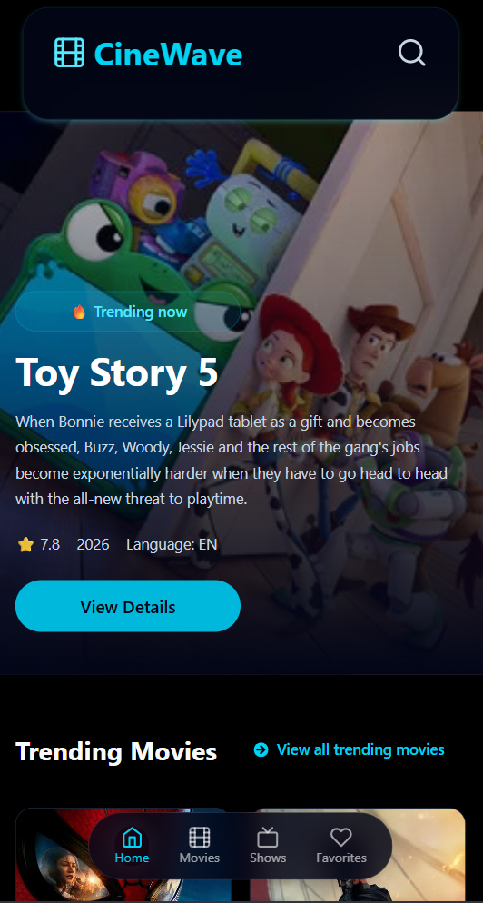
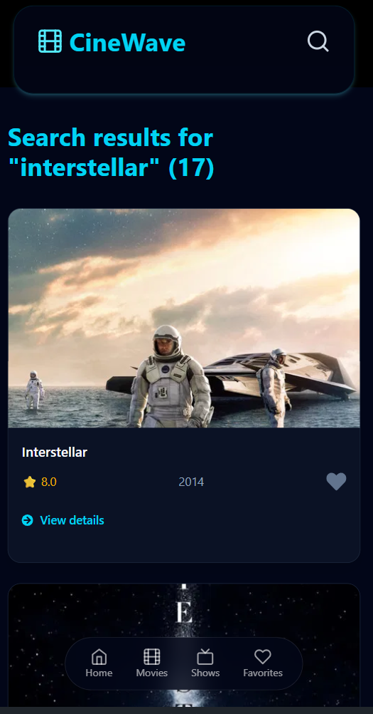
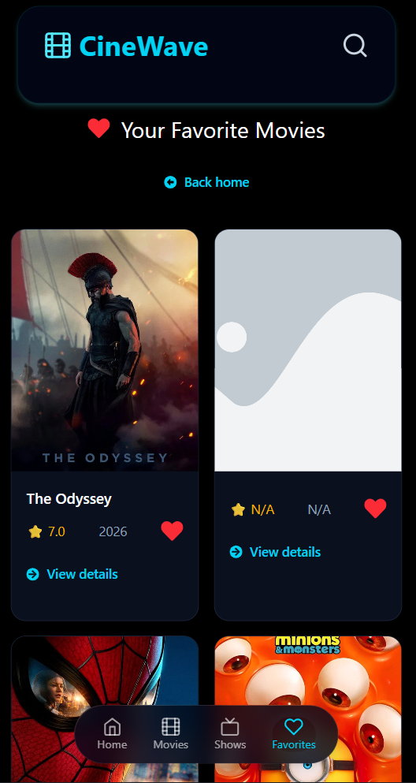
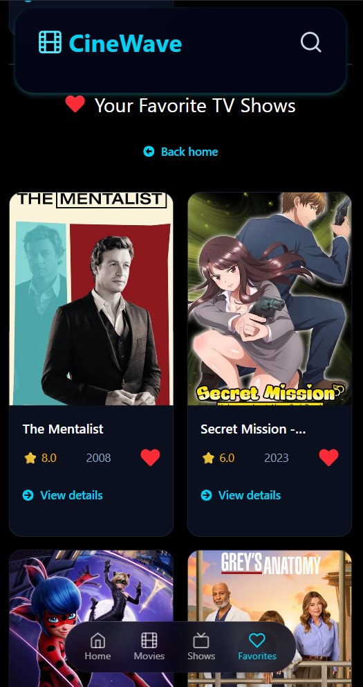
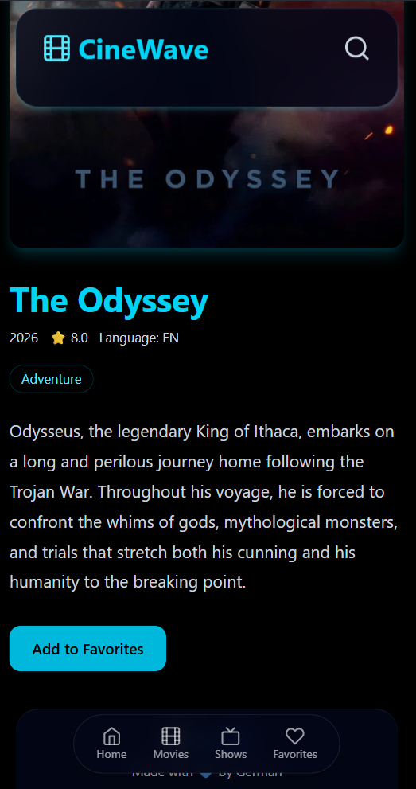
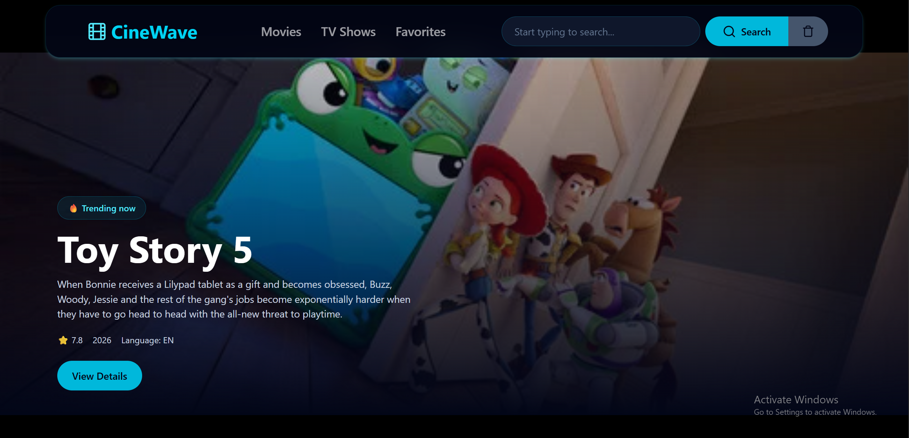
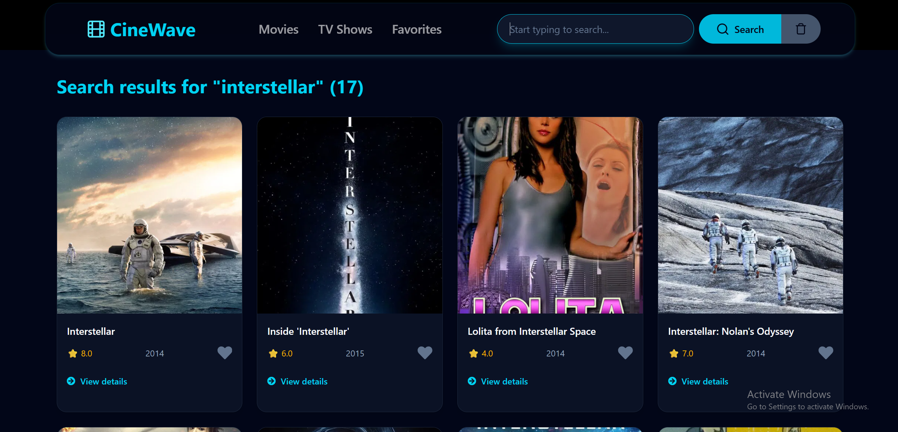
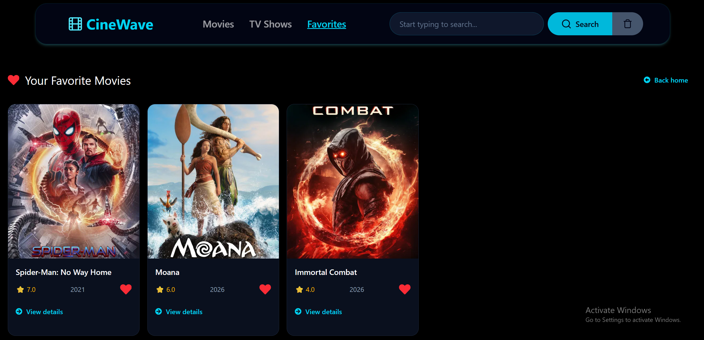
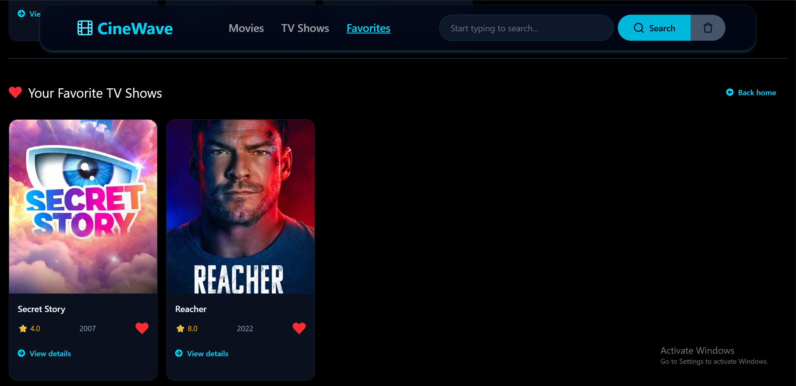
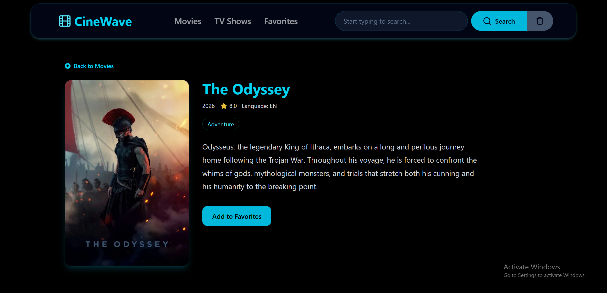

## 🎬 CineWave

CineWave is a modern movie and TV show discovery web application buiilt with React.

It uses the TMDB API to provide information about movies and TV shows.

---

# 🌐 Live Demo: https://german900-code.github.io/cinewave-website/

---

## ✨ Features

🎬 Browse popular movies
📺 Browse popular TV shows
🔥 Discover trending movies
🔎 Search for movies and TV shows
⌨️ Search using the Enter key
📄 View detailed information about movies and TV shows
❤️ Add movies and TV shows to favorites
💔 Remove items from favorites
💾 Favorites are saved in localStorage
🔔 Toast notifications for favorite actions
⏳ Skeleton loading states
🖼️ Fallback handling for missing images
📱 Responsive design
🚀 Deployed with GitHub Pages

---

## 🛠️ Technologies

React
Vite
React Router
Tailwind CSS
Framer Motion
React Icons
React Toastify
TMDB API
GitHub Actions
GitHub Pages

## 📸 Screenshots

📱Mobile

🏠 Home

🔎 Search

❤️ Favorites

📄 Details

---

💻 PC

🏠 Home

🔎 Search

❤️ Favorites

📄 Details

---

## 🚀 Getting Started

1. Clone the repository
   git clone https://github.com/German900-code/cinewave-website.git
   cd cinewave-website
2. Install dependencies
   npm install
3. Configure the TMDB API

Create a .env file in the root directory:

VITE_TMDB_TOKEN=your_tmdb_token

Replace your_tmdb_token with your TMDB API Bearer Token.

⚠️ Never commit your .env file or expose your API token publicly.

4. Start the development server
   npm run dev

The application will be available at the local address provided by Vite.

---

## 📦 Build

To create a production build:

npm run build

To preview the production build locally:

npm run preview

---

## 🌐 Deployment

CineWave is deployed using GitHub Pages and GitHub Actions.

Every push to the main branch triggers the deployment workflow:

Push to main
↓
GitHub Actions
↓
Install dependencies
↓
Build Vite application
↓
Create dist/
↓
Deploy to GitHub Pages

The TMDB token is provided to the GitHub Actions workflow through GitHub Secrets.

---

## 🎥 Data

Movie and TV show information is provided by the TMDB API.

This application uses TMDB data but is not endorsed or certified by TMDB.

---

## 📁 Project Structure

cinewave-website/
├── .github/
│ └── workflows/
│ └── deploy.yml
├── public/
├── src/
│ ├── components/
│ ├── context/
│ ├── pages/
│ └── ...
├── .env
├── .gitignore
├── index.html
├── package.json
├── vite.config.js
└── README.md

---

## 🎯 Project Goals

CineWave was created as a personal React project to practice and improve skills in:

React development
API integration
React Router
State management
Local storage
Responsive UI development
Loading and error states
Git and GitHub
CI/CD with GitHub Actions
Production deployment

---

# 👨‍💻 Author

German

GitHub: @German900-code

⭐ If you like the project, feel free to give it a star!
